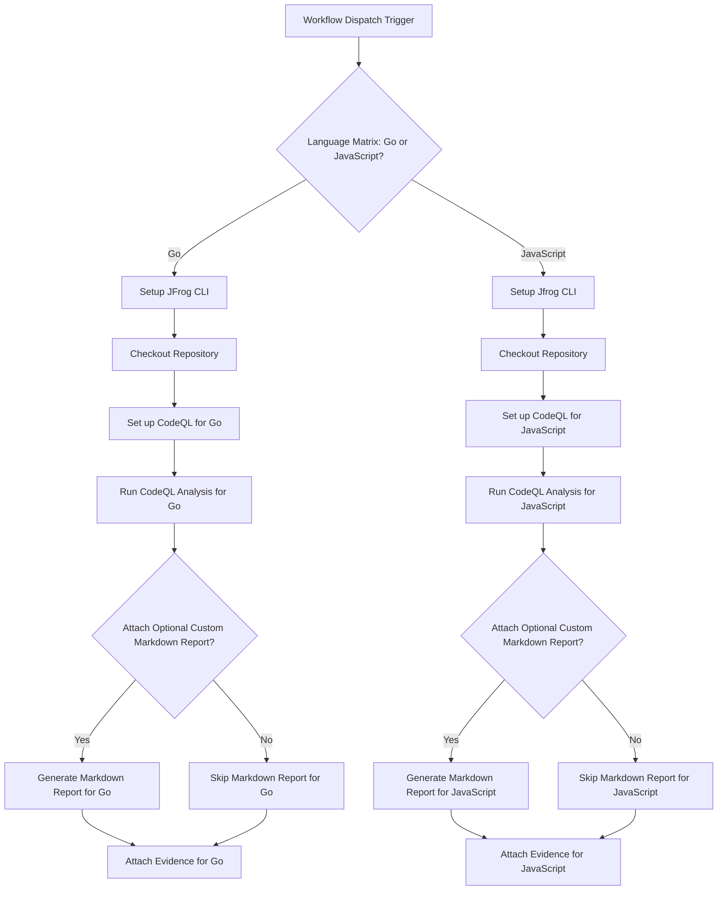

# CodeQL Security Analysis Evidence Example

This example demonstrates how to automate CodeQL security analysis for Go and JavaScript code, and attach the scan results as signed evidence to the packages in JFrog Artifactory using GitHub Actions and JFrog CLI.

##  Overview
The workflow performs CodeQL analysis on Go and JavaScript codebases, publishes the packages to Artifactory, and attaches the CodeQL analysis results as evidence. This enables traceability and security compliance in your CI/CD pipeline.

## Prerequisites
- JFrog CLI 2.76.1 or above (installed automatically in the workflow)
- Go 1.24.3 (for Go analysis)
- Node.js 18.x (for JavaScript analysis)
- The following GitHub repository variables:
    - `ARTIFACTORY_URL` (Artifactory base URL)
- The following GitHub repository secrets:
    - `ARTIFACTORY_ACCESS_TOKEN` (Artifactory access token)
    - `JFROG_SIGNING_KEY`

## Supported Languages
- Go
- JavaScript

## Workflow


## Environment Setup

### Go Package Configuration
```yaml
jf go-config --repo-resolve=go-remote --repo-deploy=go-local \
  --server-id-deploy=setup-jfrog-cli-server \
  --server-id-resolve=setup-jfrog-cli-server
```

### JavaScript Package Configuration
```yaml
jf npm-config --repo-resolve=javascript-remote --repo-deploy=javascript-local \
  --server-id-deploy=setup-jfrog-cli-server \
  --server-id-resolve=setup-jfrog-cli-server
```

## Evidence Attachment
The workflow attaches CodeQL analysis results as evidence using the following format:

### For Go Packages:
```yaml
jf evd create \
--package-name "jfrog.com/mygobuild" \
--package-version $PACKAGE_VERSION \
--package-repo-name go-local \
--key "${{ secrets.CODEQL_SIGNING_KEY }}" \
--key-alias ${{ vars.CODEQL_KEY_ALIAS }} \
--predicate "results-go/go.sarif" \
--predicate-type "http://github.com/CodeQL/static-analysis" \
--markdown "results-go/go-report.md"
```

### For JavaScript Packages:
```yaml
jf evd create \
--package-name my-javascript-build \
--package-version $PACKAGE_VERSION \
--package-repo-name javascript-local \
--key "${{ secrets.CODEQL_SIGNING_KEY }}" \
--key-alias ${{ vars.CODEQL_KEY_ALIAS }} \
--predicate "results-javascript/javascript.sarif" \
--predicate-type "http://github.com/CodeQL/static-analysis" \
--markdown "results-javascript/javascript-report.md"
```

## Workflow Trigger
The analysis is triggered on:
- Push to main branch
- Manual workflow dispatch

## References
- [CodeQL Documentation](https://codeql.github.com/docs/)
- [JFrog CLI Documentation](https://www.jfrog.com/confluence/display/CLI/CLI+for+JFrog+Artifactory)
- [GitHub CodeQL Action](https://github.com/github/codeql-action)
- [JFrog Evidence Management](https://www.jfrog.com/confluence/display/JFROG/Evidence+Management)


