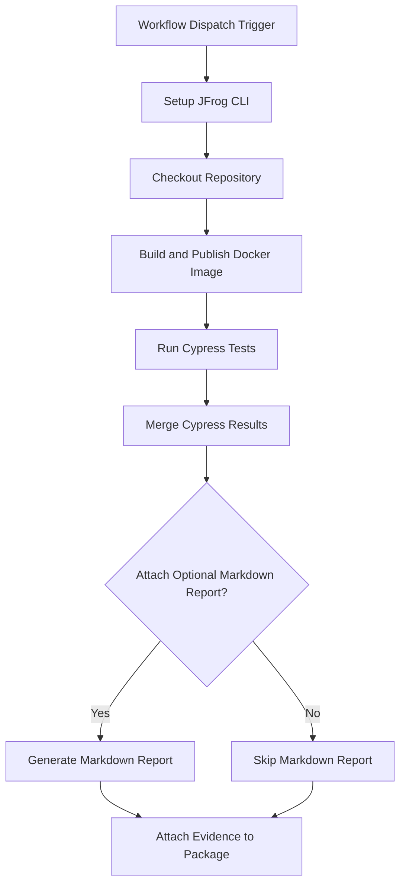

# Cypress Test Reports Evidence Example

This project demonstrates how to automate Cypress end-to-end testing for Dockerized applications and attach the signed test results as evidence to the Docker image in JFrog Artifactory using GitHub Actions and JFrog CLI.

## Overview

The workflow builds a Docker image, runs Cypress tests, generates test result evidence (JSON and Markdown), pushes the image to Artifactory, and attaches the signed Cypress test results as evidence to the image package. This enables traceability and compliance for testing in your CI/CD pipeline.

## Prerequisites

- JFrog CLI 2.65.0 or above (installed automatically in the workflow)
- Artifactory configured as a Docker registry
- The following GitHub repository variables:
    - `JF_URL` (Artifactory Docker registry domain, e.g. `mycompany.jfrog.io`)
    - `ARTIFACTORY_URL` (Artifactory base URL)
- The following GitHub repository secrets:
    - `JF_ACCESS_TOKEN` (Artifactory access token)
    - `CYPRESS_RECORD_KEY` (Cypress dashboard record key)
    - `PRIVATE_KEY` (Private key for signing evidence)
    - `PRIVATE_KEY_ALIAS` (Key alias for signing evidence)

## Environment Variables Used

- `REGISTRY_URL` - Docker registry domain (from `JF_URL`)
- `REPO_NAME` - Docker repository name
- `IMAGE_NAME` - Docker image name
- `TAG_NAME` - Docker image tag (uses GitHub run number)
- `BUILD_NAME` - Build name for Artifactory
- `BUILD_NUMBER` - Build number (uses GitHub run number)
- `ATTACH_OPTIONAL_MARKDOWN_TO_EVIDENCE` - Set to `true` to attach a Markdown report as evidence
- `UPLOAD_CYPRESS_REPORT_TO_CLOUD` - Set to `true` to record Cypress results to the Cypress Dashboard

## Workflow


## Example Usage

You can trigger the workflow manually from the GitHub Actions tab. The workflow will:

- Build and test the Docker image
- Run Cypress Tests
- Push the image to Artifactory
- Attach the Cypress test results as evidence

## Key Commands Used

- **Build and Push Docker Image:**
  ```bash
  docker build . --file ./examples/cypress/Dockerfile --tag $REGISTRY_URL/$REPO_NAME/$IMAGE_NAME:$TAG_NAME
  jf rt docker-push $REGISTRY_URL/$REPO_NAME/$IMAGE_NAME:$TAG_NAME $REPO_NAME --build-name=$BUILD_NAME --build-number=$BUILD_NUMBER
  jf rt build-publish $BUILD_NAME $BUILD_NUMBER
  ```
- **Run Cypress Tests:**
  ```yaml
  uses: cypress-io/github-action@v6
  with:
    record: ${{ env.UPLOAD_CYPRESS_REPORT_TO_CLOUD == 'true' }}
    install: true
    install-command: npm install
    start: npm run start
    quiet: true
    wait-on: 'http://localhost:3000/app.html'
    wait-on-timeout: 120
  env:
    CYPRESS_RECORD_KEY: ${{ secrets.CYPRESS_RECORD_KEY }}
  continue-on-error: true
  ```
- **Attach Evidence:**
  ```bash
    jf evd create \
    --package-name $IMAGE_NAME \
    --package-version $TAG_NAME \
    --package-repo-name $REPO_NAME \
    --key "${{ secrets.PRIVATE_KEY }}" \
    --key-alias "${{ secrets.PRIVATE_KEY_ALIAS }}" \
    --predicate "reports/overall-report.json" \
    --predicate-type "http://cypress.io/test-results/v1" \
    [--markdown "reports/cypress-results.md"]
  ```
    The --markdown flag is included only if ATTACH_OPTIONAL_MARKDOWN_TO_EVIDENCE is set to true.
## References

- [Cypress Documentation](https://docs.cypress.io/)
- [JFrog Evidence Management](https://jfrog.com/help/r/jfrog-artifactory-documentation/evidence-management)
- [JFrog CLI Documentation](https://jfrog.com/getcli/)