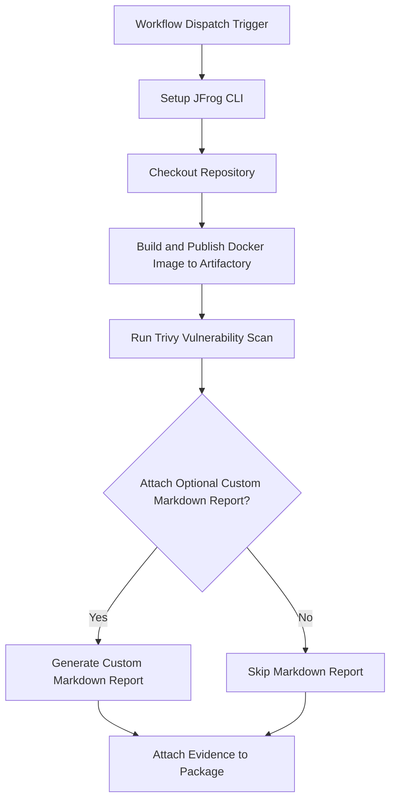

# Trivy Security Scan Evidence Example

This example demonstrates how to automate Trivy security scanning for Docker images and attach the scan results as
signed evidence to the image in JFrog Artifactory using GitHub Actions and JFrog CLI.

## Overview

The workflow builds a Docker image, scans it with Trivy for vulnerabilities, pushes the image to Artifactory, and
attaches the Trivy scan results as evidence to the image package. This enables traceability and compliance for security
scanning in your CI/CD pipeline.

## Prerequisites

- JFrog CLI 2.65.0 or above (installed automatically in the workflow)
- Artifactory configured as a Docker registry
- The following GitHub repository variables:
    - `REGISTRY_DOMAIN` (Artifactory Docker registry domain, e.g. `mycompany.jfrog.io`)
    - `ARTIFACTORY_URL` (Artifactory base URL)
    - `TRIVY_TEST_KEY` (Key alias for signing evidence)
- The following GitHub repository secrets:
    - `ARTIFACTORY_ACCESS_TOKEN` (Artifactory access token)
    - `TRIVY_TEST_PKEY` (Private key for signing evidence)

## Environment Variables Used

- `REGISTRY_DOMAIN` - Docker registry domain

## Workflow



## Example Usage

You can trigger the workflow manually from the GitHub Actions tab. The workflow will:

- Build and scan the Docker image
- Push the image to Artifactory
- Attach the Trivy scan results as evidence

## Key Commands Used

- **Build Docker Image:**
  ```bash
  docker build . --file ./examples/trivy-verify-example/Dockerfile --tag $REGISTRY_URL/$REPO_NAME/$IMAGE_NAME:$VERSION
  ```
- **Run Trivy Scan:**
  ```yaml
  uses: aquasecurity/trivy-action@master
  with:
    image-ref: ${{ env.REGISTRY_URL }}/${{ env.REPO_NAME }}/${{ env.IMAGE_NAME }}:${{ env.VERSION }}
    severity: HIGH,CRITICAL
    format: json
    output: trivy-results.json
  ```
- **Push Docker Image:**
  ```bash
  jf rt docker-push $REGISTRY_URL/$REPO_NAME/$IMAGE_NAME:$VERSION $REPO_NAME --build-name=$BUILD_NAME --build-number=${{ github.run_number }}
  ```
- **Attach Evidence:**
  ```bash
  jf evd create \
    --package-name $IMAGE_NAME \
    --package-version $VERSION \
    --package-repo-name $REPO_NAME \
    --key "${{ secrets.TRIVY_TEST_PKEY }}" \
    --key-alias ${{ vars.TRIVY_TEST_KEY }} \
    --predicate ./trivy-results.json \
    --predicate-type http://aquasec.com/trivy/security-scan
  ```

## References

- [Trivy Documentation](https://aquasecurity.github.io/trivy/)
- [JFrog Evidence Management](https://jfrog.com/help/r/jfrog-artifactory-documentation/evidence-management)
- [JFrog CLI Documentation](https://jfrog.com/getcli/)
